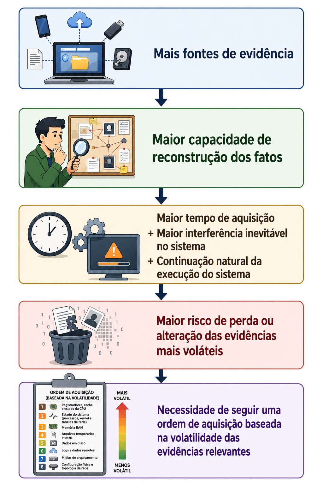

# Ordem de volatilidade

Assumir uma visão mais completa do ocorrido em um ambiente por meio da aquisição de fontes de evidência além do disco pode ser extremamente vantajoso, já que a correlação de artefatos provenientes de diferentes fontes permite ao investigador inferir sobre os eventos ocorridos em determinado ambiente com maior confiabilidade do que seria possível analisando apenas o conteúdo do disco.

A obtenção dessas fontes de dados adicionais implica em uma maior interação com o sistema investigado, o que inevitavelmente introduz mudanças em seu estado. Toda aquisição realizada em um sistema em execução acaba modificando, em alguma medida, o próprio ambiente analisado.

Na verdade, o sistema em execução continua em constante mudança mesmo sem ser manipulado pelo investigador: programas criam e encerram processos, conexões de rede são estabelecidas ou finalizadas, áreas da memória são alocadas e liberadas, serviços em segundo plano executam tarefas periódicas. A ideia principal é compreender o quão rapidamente fontes de evidência podem sofrer alterações e por que postergar a coleta ou realizar uma manipulação do sistema de forma indiscriminada ou demorada intensifica esse processo, aumentando a probabilidade de perda ou modificação dessas evidências.

> “A memória […] pode mudar tão rapidamente que registrar mesmo a maior parte dessas mudanças de forma precisa e em tempo hábil não é possível sem perturbar significativamente o funcionamento de um sistema computacional típico.”  
> (Farmer & Venema, 2005, *Forensic Discovery*, tradução minha).

> “Aumentar a quantidade de mudanças que ocorrem durante a coleta de evidências de memória pode aumentar o número de anomalias encontradas durante a análise dessas evidências.”  
> (Ligh et al., 2014, tradução minha).

Dessa forma, quanto maior for o intervalo entre o início da aquisição e a coleta de uma determinada evidência, ou quanto maior for o tempo de manipulação do sistema necessário para executar as tarefas de coleta, maior será a probabilidade de que o conteúdo dessa evidência seja alterado pela atividade normal do sistema ou pela própria atividade de aquisição. O investigador deve estar ciente desse comportamento e considerar seu impacto durante a aquisição e análise das evidências.

Com o objetivo de minimizar esse impacto, isto é, reduzir a perda de informações potencialmente relevantes, a computação forense estabelece uma prioridade para a aquisição das evidências, conhecida como **ordem de volatilidade (*order of volatility*)**. Esse princípio determina que as evidências mais voláteis sejam adquiridas primeiro, reduzindo a probabilidade de que sejam alteradas ou perdidas antes de sua coleta.

> “a ordem decrescente de volatilidade, isto é, evidências que se alteram mais rapidamente são adquiridas antes das evidências que são mais estáveis.”  
> (Ligh et al., 2014, tradução minha)

A ordem de volatilidade tradicionalmente utilizada como referência na computação forense, conforme descrita em documentos e diretrizes de organizações de referência na área, é a seguinte:

1. Conteúdo dos registradores, cache e CPU;
2. Tabela de roteamento, cache ARP, tabela de processos e estatísticas do kernel;
3. Memória (RAM);
4. Sistema de arquivos temporário e área de swap;
5. Dados armazenados em disco;
6. Dados registrados remotamente;
7. Dados armazenados em mídias de arquivamento;
8. Configuração física e topologia de rede.

Embora esse seja um modelo de referência amplamente adotado, a ordem de volatilidade deve ser encarada mais como um conceito central e norteador do que como uma lista rígida e imutável. A ordem de coleta deve considerar o contexto da investigação, o conhecimento prévio do investigador sobre o ambiente analisado e o planejamento da coleta, priorizando as evidências mais relevantes para responder às questões do caso.

Organizações devem possuir planos, diretrizes e procedimentos estabelecidos, de forma que auxiliem seus investigadores na priorização da aquisição das fontes de evidência, visando tornar esse processo consistente e adequado aos diferentes cenários investigativos. Isso porque a ordem de volatilidade pode variar de acordo com o sistema analisado e com as circunstâncias específicas de cada caso (NIST, 2006; SWGDE, 2018, tradução minha).

> “As organizações devem considerar cuidadosamente as complexidades da priorização da aquisição das fontes de dados e desenvolver planos, diretrizes e procedimentos documentados que auxiliem os analistas a realizar essa priorização de forma eficaz.”  
> (*Guide to Integrating Forensic Techniques into Incident Response*, Seção 3.1.2 – *Acquiring the Data*, NIST, 2006, tradução minha).

> “Essa ordem pode variar de acordo com o sistema computacional. O examinador deve compreender as necessidades da situação específica e priorizar a coleta dos dados voláteis de acordo com essas necessidades.”  
> (*Best Practices for Computer Forensic Acquisitions*, Seção 7.3.1 – *Live Acquisition Considerations (Order of Volatility)*, SWGDE, 2025, tradução minha).

A imagem a seguir representa a dinâmica descrita anteriormente:

  

Com base nesse entendimento, a condução do processo de aquisição deve buscar:

- Minimizar a interferência no sistema durante a coleta;
- Reduzir o tempo de aquisição, sempre que possível;
- Documentar os procedimentos adotados e as alterações inevitáveis introduzidas pela aquisição;
- Interpretar os resultados considerando que parte das alterações observadas pode decorrer da atividade normal do sistema ou do próprio processo de aquisição.

A ordem de volatilidade permanece um princípio fundamental da aquisição forense. Entretanto, a evolução dos ambientes computacionais ampliou significativamente a quantidade e a diversidade das fontes de evidência disponíveis. Embora a fundamentação conceitual seja relativamente antiga e baseada na necessidade de priorizar as evidências conforme sua probabilidade de alteração ou perda, sua execução operacional evoluiu significativamente para atender às características dos ambientes computacionais modernos, como aqueles baseados em virtualização, computação em nuvem e sistemas distribuídos.
